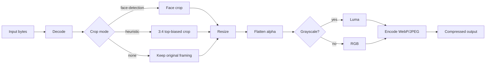

# Processing Pipeline

`idphoto` runs a deterministic image pipeline:

1. Decode input bytes (JPEG/PNG/WebP)
2. Crop (face detection, heuristic portrait, or none)
3. Resize to target max dimension
4. Flatten alpha to white background
5. Convert to grayscale (optional)
6. Encode as WebP or JPEG

## Sizing Behavior

- `max_dimension` constrains the larger dimension after crop.
- For 3:4 crop paths, output commonly lands at `36x48` for `max_dimension=48`.
- For `CropMode::None`, original aspect ratio is preserved.

## Encoding Notes

- `OutputFormat::Webp` uses lossy encoding and honors `quality` in range `0.0..=1.0`.
- `OutputFormat::Jpeg` honors `quality` in range `0.0..=1.0`.
- Grayscale mode writes single-channel payloads for smaller output.

## Face Bounds Mapping

When face detection is used, the resulting face box is remapped to output coordinates after crop+resize so downstream consumers can overlay it directly on the compressed image.
